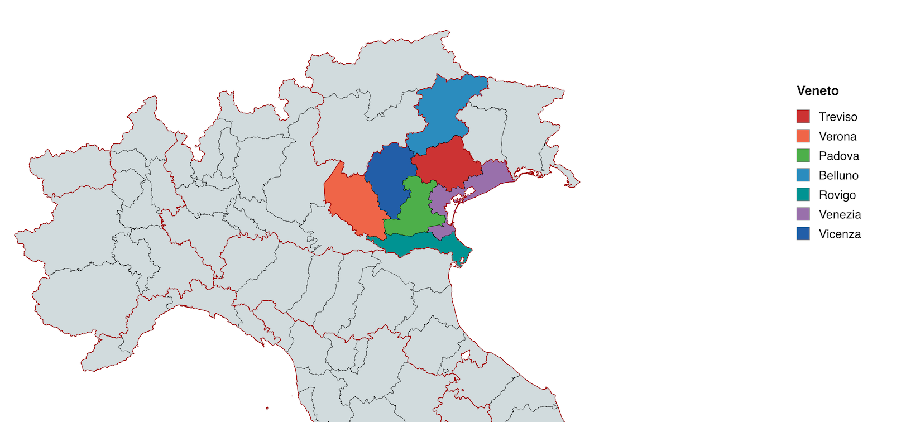

# Map of the Veneto

## The Veneto Region

The Veneto (*Vèneto* in Venetian) is a region in northeastern Italy, bordered by the Alps to the north, the Adriatic Sea to the east, and the Po River valley to the south. It encompasses seven provinces, each with internal linguistic variation. The map above shows administrative provinces, not hard dialect boundaries.

## The Dialect Areas

The labels used for dialect groups differ among authors. The practical grouping
below is meant to orient a learner, not to replace a linguistic atlas.

### Central and Southern Venetian (*Veneto Centrale e Meridionale*)

The Padovano and Vicentino varieties provide the main grammatical base for this
book. Polesano shares many features with this central-southern group while also
showing contact with Emilian varieties toward the Po.

- **Padovano** - Spoken in Padua and its province. It is widely spoken and
  especially well documented in Belloni's grammar.
- **Vicentino** - Spoken in Vicenza. Very close to Padovano.
- **Polesano** - Spoken in Rovigo province, between the Adige and Po. Forms can
  shift gradually toward Emilian near the southern edge.

### Venetian Proper (*Veneziano*)

The dialect of Venice itself is the variety most familiar internationally. It has some distinctive features:

- Stronger presence of the evanescent *l* (written *ł*)
- Some unique vocabulary related to maritime and lagoon life
- Often what tourists encounter, but not representative of the broader Venetian-speaking territory

### Western Venetian (*Veneto Occidentale*)

- **Veronese** - Spoken in Verona. Shows influence from neighboring Lombard dialects. Notable differences include *somo* for "we are" (vs. central *semo*) and different vowel patterns.

### Northern Venetian (*Veneto Settentrionale*)

- **Trevigiano** - Spoken across Treviso province, with differences between the
  lower plain and northern areas.
- **Bellunese** - Spoken in the mountain province of Belluno. It includes
  conservative features and contact with neighboring Ladin and Friulian areas.

## The Terraferma

Throughout this book, we refer to the *terraferma* ("mainland" or "dry land"). This term, dating from the Venetian Republic, distinguished the mainland territories from Venice and its lagoon. Today it simply means the Veneto outside of Venice itself.

The terraferma is where most Venetian speakers live. The major cities:

- **Padova** (Padua) - University city, Venetian cultural center
- **Treviso** - Prosecco country, well-preserved historic center
- **Vicenza** - Palladio's city, industrial heartland
- **Verona** - Roman arena, Romeo and Juliet, gateway to Lake Garda
- **Belluno** - Mountain capital, Dolomites gateway

## Beyond the Veneto

Venetian-influenced varieties extend beyond the modern regional borders:

- **Trieste** - The Triestine dialect has Venetian roots but heavy Slavic influence
- **Istria and Dalmatia** - Venetian colonial dialects survived for centuries; some speakers remain
- **Chipilo, Mexico** - A village founded by Veneto emigrants in 1882 preserves a form of Trevigiano
- **Brazil, Argentina, Australia** - Diaspora communities maintain varying degrees of Venetian

## How to Read This Map

The boundaries shown are approximate. Dialect boundaries are never clean lines; they are gradients. A speaker from Cittadella (between Padova and Vicenza) may use forms from both areas. A speaker from the Paduan hills may sound different from one in the city.

The key point: when this grammar says "central Venetian," its unmarked teaching
forms are mainly Padovano-Vicentino. Province colors on the map are geographic
orientation only. When significant forms from other areas are included, they
should be labeled.

---

*Dove che te parli, cusì te son.*

Where you speak, that is who you are.
